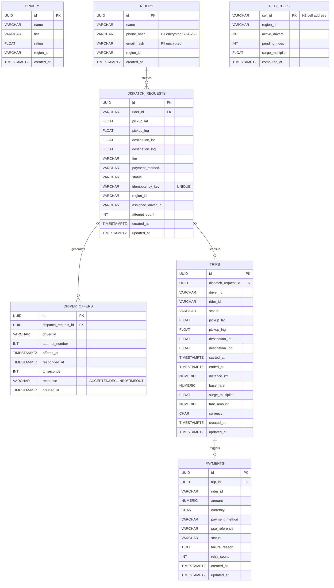

# Data Model — ERD (Dispatch Component)

## Entity Relationship Diagram

---

## Table Descriptions

### `dispatch_requests`
Central table for the ride request lifecycle. The `idempotency_key` unique constraint ensures exactly-once semantics for all POST /rides requests.

**Status transitions:**
`PENDING → DISPATCHING → ACCEPTED → IN_PROGRESS → COMPLETED`
`PENDING → CANCELLED`
`DISPATCHING → NO_DRIVER_FOUND`

**Indexes:**
- `idx_dispatch_rider` on `rider_id` — history lookups
- `idx_dispatch_status` on `status` — filter active rides
- `idx_dispatch_idempotency` UNIQUE on `idempotency_key`

---

### `driver_offers`
Append-only audit trail. Every offer sent creates a new row. The `response` column is NULL until the driver responds or times out. This allows full replay of the dispatch history.

**Indexes:**
- `idx_offer_dispatch` on `dispatch_request_id` — join to dispatch_requests
- `idx_offer_driver` on `driver_id` — driver history / decline rate calculation

---

### `trips`
Created when driver physically starts the trip. Stores fare breakdown separately (`base_fare` without surge, `fare_amount` = base × surge) for dispute resolution.

**Indexes:**
- `idx_trip_rider` on `rider_id`
- `idx_trip_driver` on `driver_id`
- `idx_trip_status` on `status`

---

### `payments`
One payment row per trip. `retry_count` tracks how many PSP attempts were made. `psp_reference` is the external payment provider's transaction ID for reconciliation.

---

### `geo_cells`
Snapshot table updated every 10s by Surge Pricing Service. `cell_id` is an H3 resolution-7 hex address (e.g. `872a1072fffffff`). The surge multiplier stored here drives fare calculation and is cached in Redis.

---

## PII Handling (GDPR/DPDP Compliance)

- `riders.phone_hash` — SHA-256 of E.164 phone number; raw number NOT stored in SQL
- `riders.email_hash` — SHA-256 of lowercase email
- Raw PII stored only in encrypted KV store (HashiCorp Vault / AWS KMS) keyed by `rider_id`
- Audit logs strip PII before writing to Kafka / Elasticsearch

---

## Migration Strategy (Flyway)

Each service owns its Flyway migration scripts in `src/main/resources/db/migration/`:
- `V1__init_dispatch_schema.sql` — initial tables
- `V2__add_region_index.sql` — add region-based partitioning index (future)

Flyway runs at service startup; `ddl-auto: validate` prevents Hibernate from auto-altering schema.
