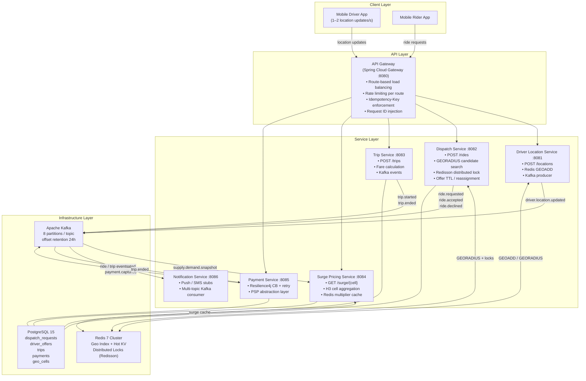
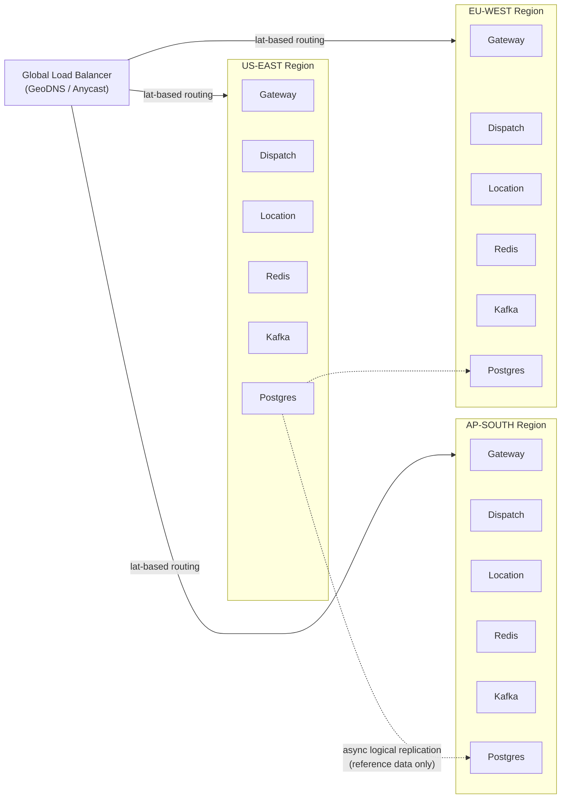
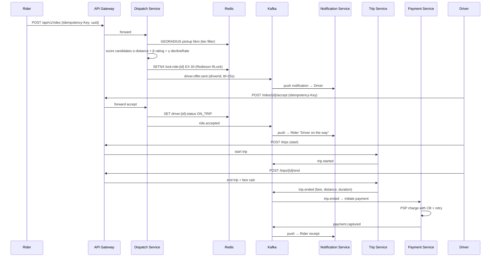

# High-Level Design — Multi-Region Ride-Hailing Platform

## 1. System Overview

A multi-tenant, multi-region ride-hailing platform modelled on Uber/Ola. The system handles:
- Real-time driver location ingestion at 500k updates/second globally
- Ride request matching with p95 dispatch ≤ 1s
- Dynamic surge pricing per H3 geo-cell
- Trip lifecycle management with fare calculation
- Payment orchestration with external PSPs
- Push/SMS notifications for key state transitions

---

## 2. Component Architecture



---

## 3. Multi-Region Architecture



**Principles:**
- Region-local writes on every hot path — no cross-region synchronous calls
- Each region has its own Kafka cluster, Redis cluster, and Postgres primary
- Reference data (fare tables, feature flags) replicated async via Postgres logical replication or CockroachDB multi-region
- Failover: GeoDNS TTL 30s; if region health-check fails, traffic shifts to nearest healthy region
- Ride requests are sticky to the originating region (rider's GPS determines region)

---

## 4. Data Flow — Ride Request Lifecycle



---

## 5. Capacity Math & Partitioning Strategy

### 5.1 Load Profile

| Signal | Value | Derivation |
|--------|-------|-----------|
| Concurrent drivers | 300,000 | Given |
| Location update rate | 500,000 updates/s | Given (≈1.7 updates/driver/s) |
| Ride requests | 60,000 req/min = **1,000 req/s** | Given |
| Peak surge (2× baseline) | 2,000 req/s | Burst capacity target |
| Concurrent trips in-flight | ~50,000 | Avg 3-min trip × 1,000 starts/s |

### 5.2 Kafka Partitioning Strategy

```
Topic: driver.location.updated
  Partitions per region: 100
  Partition key: driverId  (hash-mod → even spread)
  Throughput target: 500k msg/s ÷ 3 regions = ~167k msg/s per region
  Per-partition target: 167k ÷ 100 = 1,670 msg/s/partition  ← well under 10k/s limit
  Retention: 1 hour (only real-time consumers need this)
  Replication factor: 3 (RF=3 for durability)

Topic: ride.requested / ride.accepted / ride.declined
  Partitions per region: 50
  Partition key: rideId
  Throughput: 1,000 req/s → 20 msg/s/partition
  Retention: 24 hours (replay for audit)

Topic: trip.started / trip.ended
  Partitions per region: 30
  Partition key: tripId
  Throughput: ~500 msg/s (not all rides complete atomically)

Topic: payment.initiated / payment.captured
  Partitions per region: 20
  Partition key: paymentId
  Throughput: ~500 msg/s, but PSP latency high — async is critical

Topic: supply.demand.snapshot  (surge pricing input)
  Partitions per region: 20
  Partition key: h3CellId
  Throughput: ~2,000 cells updated/s (global rollup, not per-driver)
```

**Consumer group sizing:**
- Each partition is consumed by exactly 1 consumer thread in a group
- Dispatch Service: 10 pods × 5 threads = 50 consumers → 50 partitions on `ride.requested`
- Notification Service: 5 pods × 4 threads = 20 consumers → 20 partitions across all event topics

### 5.3 Redis Cluster Sharding

```
Cluster topology: 6 primary shards × 2 replicas = 18 nodes total
Hash slots: 16,384 distributed evenly → 2,730 slots/shard

Key naming convention (enables intelligent sharding):
  drivers:geo:{region}               → GEO set per region
  driver:{driverId}                  → HASH, shards by driverId
  lock:ride:{rideId}                 → STRING lock, shards by rideId
  surge:cell:{region}:{h3CellId}     → STRING, shards by cell
  idempotency:{service}:{key}        → STRING, shards by key

Memory estimate (per region):
  300k drivers × 80 bytes/HASH = 24 MB   (driver hashes)
  300k drivers × 16 bytes/GEO  =  5 MB   (geo index entries)
  50k active rides × 64 bytes   =  3 MB   (locks + idempotency)
  10k H3 cells × 32 bytes       = 0.3 MB  (surge cache)
  ─────────────────────────────────────────
  Total per region               ≈ 32 MB  (trivial; headroom for 100× growth)

Write throughput:
  500k location GEOADD/s → 500k Redis writes/s
  Single Redis node handles ~100k write ops/s
  → Minimum 5 shards needed; 6 shards gives 20% headroom
```

**Key pattern: `drivers:{region}:{geocell}`**

For searches scoped to a geographic sub-area (surge pricing, local dispatch), we create per-cell GEO sets:
```
drivers:us-east:8928308280fffff   ← H3 level-8 hex covering ~0.74 km²
drivers:ap-south:8928308280fffff
```
This limits GEORADIUS search to cells neighbouring the pickup point (~7 hexes), reducing result-set size from 50k region-wide to ~500 local drivers.

### 5.4 Scaling Strategy

| Component | Scaling Approach | Instance Count (peak) |
|-----------|-----------------|----------------------|
| API Gateway | Horizontal — stateless, ALB target group | 4 pods |
| Driver Location Service | Horizontal — stateless Kafka producer, partitioned by driverId | 8 pods |
| Dispatch Service | Horizontal — Redisson lock prevents double-dispatch | 10 pods |
| Trip Service | Horizontal — idempotency via DB unique key | 6 pods |
| Surge Pricing Service | Horizontal — read-heavy, Redis-cached multipliers | 4 pods |
| Payment Service | Horizontal — outbox ensures at-least-once delivery | 4 pods |
| Kafka | 100+50+30+20+20 partitions/topic × RF=3 | 9 brokers |
| Redis Cluster | 6 primary + 12 replica nodes | 18 nodes |
| Postgres | 1 primary + 2 read replicas + PgBouncer | 3 nodes |

**Location throughput math (detailed):**
- 300k drivers × 1.7 updates/s = **510k msg/s** (matches given 500k target)
- Kafka: 100 partitions × 5,100 msg/s/partition ≤ 10k/s limit → ✅
- Redis: 510k GEOADD/s ÷ 6 shards = 85k ops/s/shard ≤ 100k limit → ✅
- Network: 510k × 150 bytes/msg = 76 MB/s inbound ≤ 1 Gbps NIC → ✅

---

## 6. Storage Design

### Redis Key Patterns
| Key | Type | Purpose | TTL |
|-----|------|---------|-----|
| `drivers:geo` | GEO | Lat/lng index for GEORADIUS | - |
| `driver:{id}` | HASH | status, tier, rating, lastSeen | 30s |
| `lock:ride:{id}` | STRING | Redisson distributed lock | 30s |
| `offer:ttl:{rideId}:{driverId}` | STRING | Offer expiry sentinel | 15s |
| `surge:cell:{h3cellId}` | STRING | Surge multiplier (float) | 5m |
| `idempotency:{svc}:{key}` | STRING | Replay protection | 24h |

### Postgres Schema Summary
- `dispatch_requests` — ride lifecycle, idempotency_key unique index
- `driver_offers` — audit trail of all offers per ride
- `trips` — fare breakdown, surge multiplier, distance
- `payments` — PSP reference, retry count, status
- `geo_cells` — H3 cell snapshot for surge audit

---

## 7. Multi-Tenancy Design

The platform is designed as a **schema-per-tenant-column** model — all tenants share the same tables, distinguished by `tenant_id`. This is the pragmatic choice at our scale (hundreds of tenants, not millions).

### 7.1 Data Isolation — `tenant_id` Column

Every core table carries a `tenant_id` column with a DB-level index:

| Table | tenant_id index |
|-------|----------------|
| `dispatch_requests` | `idx_dispatch_tenant` |
| `trips` | `idx_trip_tenant` |
| `payments` | `idx_payment_tenant` |
| `payment_outbox` | `idx_outbox_tenant` |
| `geo_cells` | `idx_geocell_tenant` |

All queries in service layers filter by `tenant_id` (enforced at the repository layer via Spring Data JPA specifications or method name queries like `findByTenantIdAndStatus`).

### 7.2 Request Flow — Header Propagation

```
Client → API Gateway: X-Tenant-ID: tenant-acme
  └→ TenantValidationFilter (order -150):
       1. Validate header is present → 400 if missing
       2. Check Redis rate limit counter: rate:{tenantId}:{windowBucket}
       3. Propagate header downstream
  └→ Downstream services read X-Tenant-ID from request
       → Set in service layer when persisting entities
       → Included in all Kafka event payloads (tenantId field on TripEvent etc.)
```

### 7.3 Per-Tenant Rate Limiting

Implemented in `TenantValidationFilter` using Redis sliding-window counters:

```
Key:   rate:{tenantId}:{epoch_second}
TTL:   2 seconds
Limit: 200 req/s (standard) | 1000 req/s (premium tenants)

Response headers:
  X-RateLimit-Limit: 200
  X-RateLimit-Remaining: 147
  Retry-After: 1  (only on 429)
```

### 7.4 Kafka Topic Partitioning by Tenant + Region

For topics where tenant isolation matters, the partition key is `{tenantId}:{regionId}`:

```java
kafkaTemplate.send(topic, tenantId + ":" + regionId, event);
```

This ensures all events for a given tenant+region land on the same partitions, enabling per-tenant ordered consumption and future per-tenant consumer group isolation.

### 7.5 Feature Flags per Tenant

Feature flags are stored as Redis hashes:

```
Key:    feature-flags:{tenantId}
Fields: surge_pricing_enabled=true
        real_time_tracking=true
        premium_matching=false
```

Services check flags before executing optional features:

```java
// Conceptual — real impl: inject a FeatureFlagService bean
Boolean surgeEnabled = redisTemplate.opsForHash()
    .get("feature-flags:" + tenantId, "surge_pricing_enabled");
if (Boolean.TRUE.equals(surgeEnabled)) { ... }
```

---

## 8. Payment Reliability — Transactional Outbox Pattern

The original approach had a **dual-write race condition**: if the Postgres `INSERT` committed but the `kafkaTemplate.send()` failed (network blip, broker down), the payment event would be silently lost.

### 8.1 Problem: Dual-Write Race

```
❌ Old flow:
  DB.commit(payment row)     ← succeeds
  kafkaTemplate.send(event)  ← network error → event lost forever
  Trip completion blocked on PSP response time (250ms–2s)
```

### 8.2 Solution: Transactional Outbox

```
✅ New flow:
  ┌── Single DB Transaction (atomic) ──────────────────────────┐
  │  INSERT payments (status=PENDING)                          │
  │  INSERT payment_outbox (status=PENDING, payload=JSON)      │
  └────────────────────────────────────────────────────────────┘
  Trip completion returns IMMEDIATELY ← not blocked by PSP

  OutboxPublisher (every 500ms, separate thread):
    SELECT * FROM payment_outbox WHERE status='PENDING' LIMIT 50
    → kafkaTemplate.send(event).get()  ← synchronous confirm
    → UPDATE payment_outbox SET status='PUBLISHED'

  PSP charge runs independently after PAYMENT_INITIATED event
```

### 8.3 Reliability Properties

| Property | Guarantee |
|----------|-----------|
| At-least-once delivery | Outbox entry retried until PUBLISHED |
| No lost events on PSP failure | FAILED status, manual retry queue |
| Trip completion latency | ~5ms (DB write only, no PSP wait) |
| Max event delivery lag | ~500ms (poll interval) |
| Deduplication | Consumers must be idempotent (paymentId as key) |

In production, this outbox poller would be replaced by **Debezium CDC** tailing the Postgres WAL, achieving sub-10ms delivery lag without polling.

---

## 9. Trade-offs

| Decision | Choice | Rationale |
|----------|--------|-----------|
| Geospatial index | Redis GEO | Sub-millisecond GEORADIUS; fits hot driver set in memory |
| Dispatch locking | Redisson RLock | Distributed mutex prevents double-dispatch in scaled pods |
| Event bus | Kafka | Durable, replayable, back-pressure via consumer groups |
| Surge cell granularity | H3 resolution 8 (~0.74km²) | Finer demand signal; sliding 5-min window smooths noise |
| Trip DB | Postgres (not NoSQL) | ACID required for fare + payment reconciliation |
| Payment events | Transactional Outbox | Decouples trip completion from PSP; at-least-once delivery |
| Payment retry | Resilience4j CB + exponential backoff | PSP latency is outside our control |
| Multi-region sync | Async replication (no hot-path cross-region) | Latency SLO would be violated otherwise |
| Multi-tenancy | tenant_id column + API Gateway filter | Simpler than schema-per-tenant; sufficient at current scale |
