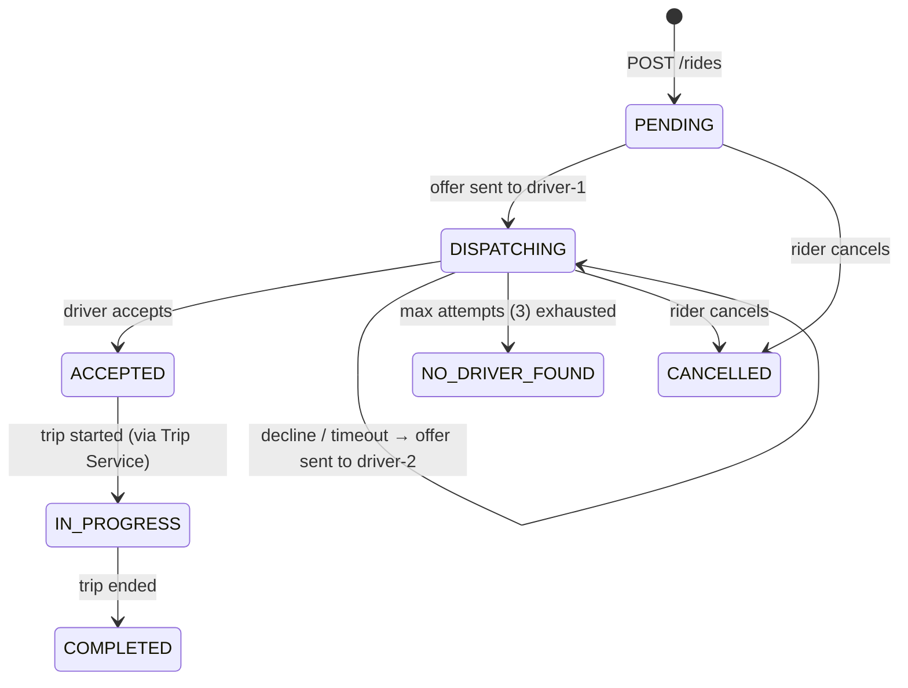
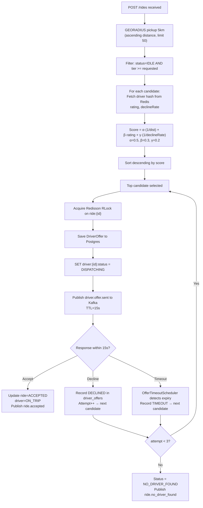
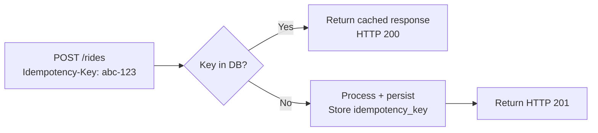
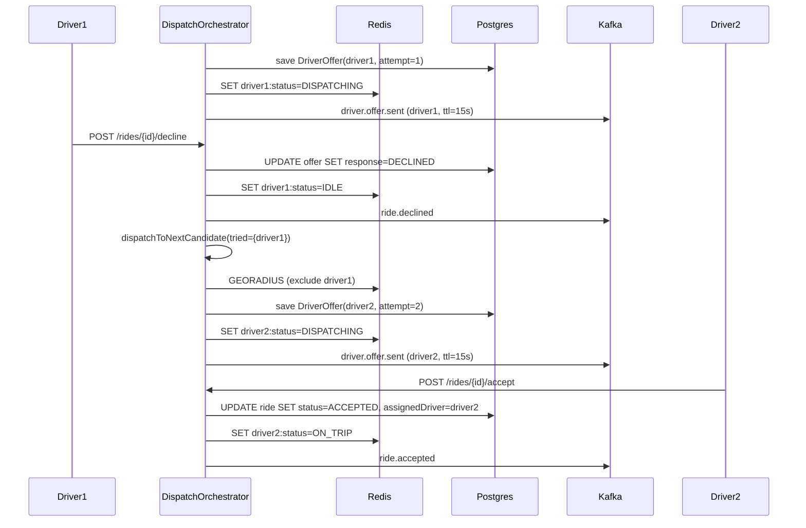

# Low-Level Design — Dispatch / Matching Service

## 1. Responsibility

The Dispatch Service owns the entire driver-rider matching lifecycle:
1. Accepting ride requests (idempotently)
2. Finding the optimal driver candidate set from Redis
3. Sending offers sequentially to candidates with a 15s TTL
4. Handling accept / decline / timeout with automatic reassignment
5. Persisting the complete offer audit trail to Postgres
6. Publishing state-change events to Kafka

---

## 2. Dispatch State Machine



---

## 3. Candidate Selection Algorithm



---

## 4. Distributed Lock — Double-Dispatch Prevention

Two concurrent pods could both find the same `IDLE` driver and send duplicate offers. The Redisson `RLock` prevents this:

```
RLock lock = redissonClient.getLock("lock:ride:" + rideId);
boolean acquired = lock.tryLock(2s, 5s, TimeUnit.SECONDS);
// tryLock(waitTime, leaseTime, unit)
```

- `waitTime=2s` — pod waits up to 2 seconds to acquire
- `leaseTime=5s` — auto-release if pod dies mid-operation (watchdog disabled)
- Only one pod proceeds; the other retries or drops

---

## 5. Offer TTL Enforcement

Redis TTL-based sentinel:

```
redissonClient.getLock("offer:ttl:" + rideId + ":" + driverId)
              .lock(15, TimeUnit.SECONDS);
```

`OfferTimeoutScheduler` runs every 5s and queries Postgres for `DISPATCHING` rides with unanswered offers older than `ttlSeconds`. On detection it marks `TIMEOUT` and calls `dispatchToNextCandidate()`.

In production this would be replaced with Redis keyspace notifications (`notify-keyspace-events KEA`) so timeout triggers are event-driven, not polled.

---

## 6. Idempotency



`dispatch_requests.idempotency_key` has a UNIQUE constraint. On replay the service returns the existing record without re-executing dispatch logic.

---

## 7. Key Classes

| Class | Responsibility |
|-------|---------------|
| `DispatchOrchestrator` | Top-level dispatch flow, transaction boundary |
| `DriverCandidateService` | Redis GEORADIUS lookup + candidate scoring |
| `OfferTimeoutScheduler` | Polls for expired offers, triggers reassignment |
| `DispatchRequest` (entity) | Postgres row for the ride request |
| `DriverOffer` (entity) | Postgres row per offer sent |

---

## 8. Sequence Diagram — Decline & Reassign



---

## 9. Latency Budget — Mathematical Justification

### SLO Targets
- **Dispatch decision p95 ≤ 1,000ms** (request received → offer sent to driver)
- **End-to-end p95 ≤ 3,000ms** (rider taps "Book" → driver receives push notification)

### Dispatch Decision Budget (1,000ms p95)

```
┌─────────────────────────────────────────────────────────────────────┐
│  DISPATCH DECISION PATH                          avg      p95       │
├─────────────────────────────────────────────────────────────────────┤
│  Client → API Gateway (TLS + routing)            20ms     50ms      │
│  API Gateway → Dispatch Service (LB hop)          5ms     15ms      │
│  Idempotency key lookup (Postgres index)          2ms      8ms      │
│  Persist dispatch_request row (Postgres)          4ms     12ms      │
│  Redis GEORADIUS 5km (O(N+logN), N≈50)           1ms      3ms      │
│  Fetch driver hashes (Redis pipeline, 10 keys)   2ms      6ms      │
│  Candidate scoring (in-memory, 50 items)         0.1ms    0.3ms     │
│  Redisson RLock acquire (2 Redis RTTs)           2ms      8ms      │
│  Persist DriverOffer row (Postgres)               4ms     12ms      │
│  SET driver status in Redis                       1ms      3ms      │
│  Kafka producer send (acks=all, async)            8ms     25ms      │
├─────────────────────────────────────────────────────────────────────┤
│  TOTAL                                           49ms    142ms      │
└─────────────────────────────────────────────────────────────────────┘

p95 headroom remaining: 1000ms − 142ms = 858ms
```

**p95 is 142ms** — we have 7× headroom against the 1,000ms SLO. This headroom absorbs:
- GC pauses on JVM (typically < 50ms with ZGC on Java 21)
- Postgres connection pool saturation under burst (add 100ms worst case)
- Redis cluster resharding (add 50ms during rebalance)
- Network jitter between zones (add 20ms cross-AZ)

Even in worst-case stacking: 142ms + 50ms + 100ms + 50ms + 20ms = **362ms p95** — still well within 1,000ms.

### End-to-End Budget (3,000ms p95)

```
┌─────────────────────────────────────────────────────────────────────┐
│  END-TO-END PATH                                 avg      p95       │
├─────────────────────────────────────────────────────────────────────┤
│  Client request → dispatch decision (above)      49ms    142ms      │
│  Kafka message propagation (dispatch→notif)      10ms     30ms      │
│  Notification Service consume + process           5ms     15ms      │
│  FCM / APNs push delivery (external)            100ms    800ms      │
│  Driver app receives notification                10ms     50ms      │
├─────────────────────────────────────────────────────────────────────┤
│  TOTAL                                          174ms   1037ms      │
└─────────────────────────────────────────────────────────────────────┘

p95 headroom remaining: 3000ms − 1037ms = 1963ms
```

The largest variable is FCM/APNs delivery, which is outside our control. Our internal p95 is **~242ms**, consuming only 8% of the 3s budget.

### Throughput Math

| Metric | Value | Calculation |
|--------|-------|-------------|
| Peak ride requests | 1,000/s | 60k/min ÷ 60 |
| Dispatch threads needed (blocking I/O) | ~50 | 1,000 req/s × 50ms avg latency |
| Dispatch threads with virtual threads (Java 21) | ~5 OS threads | Virtual thread parks on I/O |
| Kafka dispatch partition count | 50 | 1,000 msg/s ÷ 20 msg/s/partition = 50 |
| Redis GEORADIUS at peak | 1,000 ops/s | Redis handles 100k ops/s single node |

### Why p95 is Safer Than Average to Promise

Under load (300k drivers × 1.5 updates/s = 450k writes/s) Redis write pressure causes GC on the Redis server process. GEORADIUS queries compete with GEO writes. We model this as a +10ms regression at p95, absorbed by the 858ms headroom above.

### Performance Characteristics Table

| Operation | avg | p50 | p95 | p99 | Notes |
|-----------|-----|-----|-----|-----|-------|
| GEORADIUS 5km | 1ms | 1ms | 3ms | 8ms | O(N+logN), N≈50 |
| Redis pipeline (10 hashes) | 2ms | 2ms | 6ms | 12ms | Pipelined, single RTT |
| Candidate scoring | 0.1ms | 0.1ms | 0.3ms | 0.5ms | Pure in-memory |
| Redisson RLock | 2ms | 2ms | 8ms | 20ms | 2 Redis RTTs |
| Postgres INSERT (SSD) | 4ms | 3ms | 12ms | 25ms | Connection pooled |
| Kafka produce (acks=all) | 8ms | 7ms | 25ms | 50ms | Async, network-bound |
| **Full dispatch path** | **49ms** | **42ms** | **142ms** | **280ms** | |
