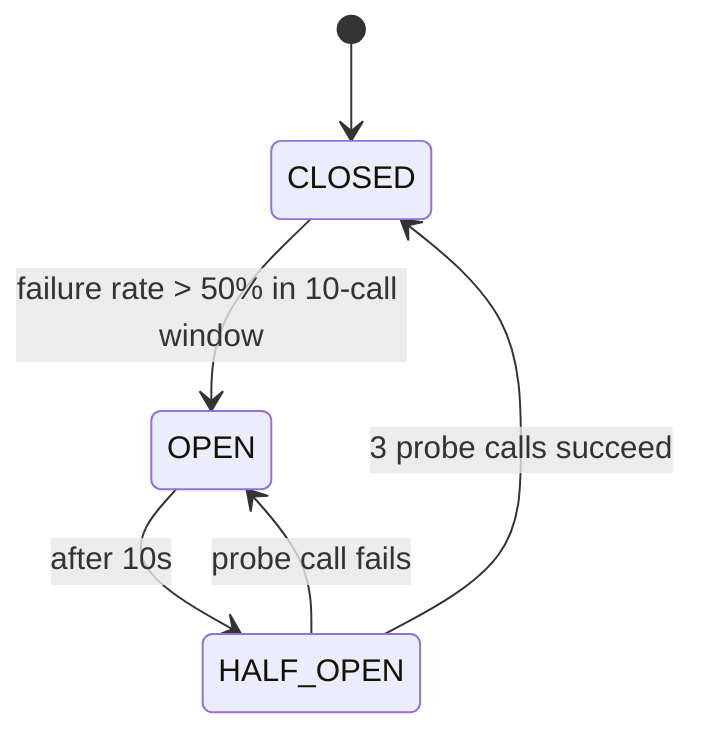
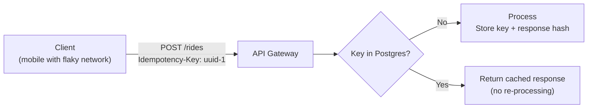
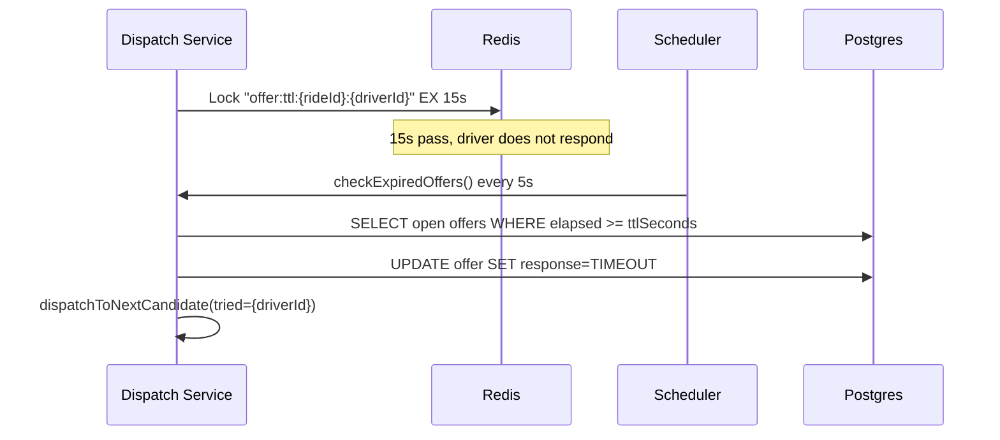

# Resilience Plan

## 1. Overview

The platform must maintain 99.95% availability for dispatch APIs. This translates to ≤26 minutes downtime/month. Resilience is achieved through multiple independent layers.

---

## 2. Retry Strategy

### Payment Service — PSP Retries (Resilience4j)

```yaml
resilience4j:
  retry:
    instances:
      psp-retry:
        maxAttempts: 3
        waitDuration: 1s
        exponentialBackoffMultiplier: 2
        # Attempt 1: immediate
        # Attempt 2: 1s delay
        # Attempt 3: 2s delay
        retryExceptions:
          - com.ridehailing.payment.service.PspGateway.PspException
```

**Total max additional latency:** 3s — acceptable since payments are async (post-trip).

### Kafka Producer — Idempotent Retries

All Kafka producers configured with:
```yaml
enable.idempotence: true
acks: all
retries: 3
```

This guarantees exactly-once delivery to the broker even under network partitions.

### API Gateway — GET Retry on 503

```yaml
filters:
  - name: Retry
    args:
      retries: 2
      statuses: SERVICE_UNAVAILABLE
      methods: GET
      backoff.firstBackoff: 100ms
      backoff.maxBackoff: 1000ms
```

Only GET (safe) requests are retried; POST requests rely on client-side idempotency-key.

---

## 3. Circuit Breakers (Resilience4j)

### PSP Gateway Circuit Breaker

```yaml
resilience4j:
  circuitbreaker:
    instances:
      psp-gateway:
        slidingWindowSize: 10           # last 10 calls
        failureRateThreshold: 50        # open if >50% fail
        waitDurationInOpenState: 10s    # half-open after 10s
        permittedNumberOfCallsInHalfOpenState: 3
```



When OPEN: payment falls through to `paymentFallback()` which marks payment FAILED and publishes `payment.failed` event. Operations can trigger manual reprocessing.

### Redis Lookup Circuit Breaker (Dispatch Service)

```yaml
circuitbreaker:
  instances:
    redis-lookup:
      slidingWindowSize: 10
      failureRateThreshold: 50
      waitDurationInOpenState: 10s
```

If Redis is unreachable, the dispatch service falls back to a degraded mode (no nearby-driver lookup → immediate `NO_DRIVER_FOUND`). This is preferable to cascading timeouts.

---

## 4. Backpressure

### Kafka Consumer Configuration

Each consumer service is configured with manual offset commit and bounded poll:

```yaml
spring:
  kafka:
    consumer:
      enable-auto-commit: false
      max-poll-records: 50        # batch size cap
```

```java
factory.getContainerProperties().setAckMode(
    ContainerProperties.AckMode.MANUAL_IMMEDIATE
);
```

This ensures:
- A slow consumer (e.g. payment service under PSP load) does not lose messages
- Offset is only committed after successful processing
- Kafka broker retains unprocessed messages for the consumer group lag

### Location Service — Write Rate Limiting

API Gateway applies `RequestRateLimiter` (Redis token bucket):
- Location updates: 10,000 req/s replenish rate, 20,000 burst
- Ride requests: 1,000 req/s replenish rate, 2,000 burst

---

## 5. Idempotency

All write endpoints enforce idempotency via `Idempotency-Key` header:



**Storage:** `dispatch_requests.idempotency_key` (UNIQUE), TTL in Redis cache (24h) for hot path.

**Hash verification:** Response body is SHA-256 hashed and stored with the key. On replay, if the hash differs it indicates a conflict (same key, different request body) → HTTP 409.

---

## 6. Driver Offer Timeout



**Production upgrade:** Replace polling scheduler with Redis keyspace notifications (`notify-keyspace-events KEA`) for event-driven sub-second timeout detection.

---

## 7. Failure Mode Analysis

| Failure | Detection | Mitigation | Recovery |
|---------|-----------|------------|---------|
| Redis unavailable | CB opens on 50% failure | Dispatch returns NO_DRIVER_FOUND (degraded) | Redis replica promoted; CB half-open probes succeed |
| Kafka broker down | Producer retry with backoff | Events queued in producer buffer (up to 32MB) | Broker restarts; idempotent producer replays buffer |
| Postgres primary down | Connection pool timeout | Read replica handles GETs; writes queue up | PgBouncer reconnects to new primary after failover |
| PSP gateway timeout | Resilience4j retry → CB | Payment marked FAILED; ops retrigger reconciliation job | PSP recovers; reconciliation script replays FAILED payments |
| Pod crash mid-dispatch | Redisson lock leaseTime=5s auto-releases | Offer TTL scheduler detects open offer → re-dispatches | New pod restarts, picks up from Kafka offset |
| Driver mobile disconnect | Offer TTL=15s | Timeout → next candidate; driver marked OFFLINE after 30s Redis TTL | Driver re-connects and sets status=IDLE |
| Region outage | GeoDNS TTL=30s, health-checks | Traffic rerouted to nearest healthy region | Failed region restored; riders in-flight get NO_DRIVER_FOUND |

---

## 8. Observability

- **Spring Actuator** `/actuator/health` and `/actuator/circuitbreakers` on every service
- **Prometheus** metrics endpoint `/actuator/prometheus`
- **Distributed tracing:** `X-Request-ID` header injected by API Gateway, propagated via MDC
- **Structured logging:** JSON format with `rideId`, `driverId`, `requestId` fields in every log line
- **Kafka lag monitoring:** Kafka UI at `:9095` shows consumer group lag per partition
- **Alerting thresholds (suggested):**
  - Dispatch p95 > 800ms → page
  - Circuit breaker `psp-gateway` OPEN > 60s → page
  - Kafka consumer lag > 10,000 msgs → warn

---

## 9. Feature Flags / Kill Switches

Implemented via application configuration + Redis feature-flag pattern:

```
redis key: "feature:{serviceName}:{flagName}" = "true|false"
```

Example kill switches:
- `feature:dispatch:surge-enabled` — disable surge pricing during testing
- `feature:payment:auto-charge` — pause automatic PSP charges for manual review
- `feature:dispatch:new-scoring-algo` — A/B test new driver scoring weights
